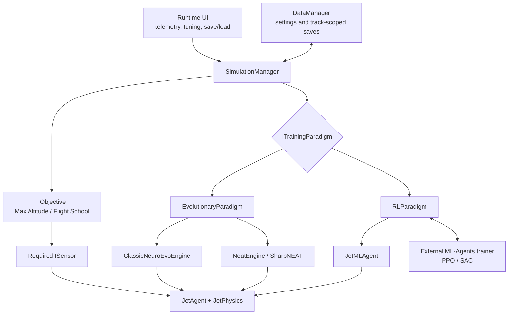

# Aerial Plane Attack

> A Unity flight-simulation sandbox where AI-controlled jets learn to fly through neuroevolution and reinforcement learning.

[](https://unity.com/)
[](https://github.com/Unity-Technologies/ml-agents)
[](LICENSE)
[](#authors)

Aerial Plane Attack puts several learning approaches into the same 3D flight environment so they can be trained, observed, tuned, saved, and compared under the same physics and objectives. Jets can learn to gain altitude or race through waypoint courses using fixed-topology neuroevolution, NEAT, PPO, or SAC.

## Visuals

> [!NOTE]
> **Project demo placeholder** — add a screenshot, GIF, or short video here when the media is ready.
>
> Suggested file: `docs/media/training-demo.gif`

<!-- Replace the note above with:

-->

> [!NOTE]
> **Telemetry / architecture screenshot placeholder** — this is a good place for the training dashboard, brain visualizer, or runtime parameter editor.
>
> Suggested file: `docs/media/telemetry-dashboard.png`

<!-- Replace the note above with:

-->

## What the project does

The simulation provides a shared training loop for four AI types:

| AI type | Learning approach | Implementation |
| --- | --- | --- |
| `FixedNeuroEvo` | Fixed-topology neuroevolution | Custom `ClassicNeuroEvoEngine` |
| `NEAT` | Evolving topology and weights | SharpNEAT 2.4 |
| `PPO_MLAgents` | Reinforcement learning with PPO | Unity ML-Agents |
| `SAC_MLAgents` | Reinforcement learning with SAC | Unity ML-Agents |

The currently implemented training objectives are:

- **Max Altitude** — learn stable control that gains as much altitude as possible.
- **Flight School** — navigate a sequence of hoops as a waypoint race.

Around those objectives, the project includes:

- a shared aerodynamic jet controller and sensor pipeline;
- live telemetry, population statistics, and brain visualization;
- runtime editing for reward parameters, model hyperparameters, and network shape;
- track-specific training saves, checkpoint resume, and single-jet inference replay;
- automatic generation of ML-Agents trainer configuration;
- automatic launch of the external Python trainer for PPO and SAC;
- scene cameras, jet selection, weapons, and early dogfight-mode support.

Dogfight UI, camera, selection, and weapon systems exist, but combat training is not yet implemented: there is currently no dogfight objective or combat sensor.

## Why we built it

Learning to control an aircraft is a useful AI challenge: control actions interact with momentum, orientation, lift, drag, sparse goals, and failure states over time. Comparing algorithms is difficult when every experiment uses a different environment, physics model, reward system, or telemetry stack.

This project gives evolutionary algorithms and modern reinforcement-learning algorithms the same aircraft, sensors, objectives, save system, and visual feedback. It was built to make experimentation more repeatable and to turn otherwise abstract AI concepts into something visible: a population improves, a policy learns a course, and parameter changes can be observed directly in the simulation.

## Who it is for

- students and instructors exploring neuroevolution or reinforcement learning;
- Unity developers interested in ML-Agents integration;
- AI hobbyists who want a visual environment for comparing learning methods;
- researchers and prototypers looking for an extensible flight-control testbed.

## Getting started

### Prerequisites

- [Git](https://git-scm.com/downloads)
- [Unity Hub](https://unity.com/download)
- **Unity Editor 6000.3.10f1** (revision `e35f0c77bd8e`)
- Windows 11 or a recent Windows 10 installation for the bundled PPO/SAC environment

The evolutionary modes do not require Python or any external build step. PPO and SAC use an additional prebuilt ML-Agents environment downloaded in step 3.

### 1. Clone the repository

Open PowerShell and run:

```powershell
git clone https://github.com/Tal-Gordon/Aerial-Plane-Attack-Cool-XXX3.git
Set-Location .\Aerial-Plane-Attack-Cool-XXX3
```

### 2. Install the correct Unity version

In Unity Hub:

1. Open **Installs** and choose **Install Editor**.
2. Install **Unity 6000.3.10f1**.
3. Open **Projects**, choose **Add**, and select the cloned `Aerial-Plane-Attack-Cool-XXX3` folder.

Select the repository root as the Unity project—not its `Assets` folder. Unity will resolve the packages from `Packages/manifest.json` during the first import.

### 3. Install the RL training environment (PPO/SAC only)

From the repository root, run:

```powershell
powershell.exe -NoProfile -ExecutionPolicy Bypass -File .\download-env.ps1
```

The script downloads the tag-pinned `env-v1` archive (about 1.7 GB), resumes interrupted downloads, and extracts it to:

```text
Assets/StreamingAssets/mlagents-env/
```

The extracted environment is about 3.3 GB. It contains Python 3.10, ML-Agents 1.1.0, PyTorch, and the other pinned trainer dependencies, so a separate Python or Conda installation is not required. The script is idempotent and can safely be run again.

> [!IMPORTANT]
> Archive extraction requires a Windows `tar.exe` with Zstandard support. Windows 11 and recent Windows 10 versions include it.

Skip this step when using `FixedNeuroEvo` or `NEAT`.

### 4. Open and run the simulation

Launch the project from Unity Hub. From PowerShell, the default Unity Hub installation can also be launched directly:

```powershell
& "C:\Program Files\Unity\Hub\Editor\6000.3.10f1\Editor\Unity.exe" -projectPath (Get-Location)
```

After Unity finishes importing:

1. Open `Assets/Scenes/Max Altitude.unity` for altitude training, or one of `Track 1.unity`, `Track 2.unity`, and `Track 3.unity` for Flight School.
2. Press **Play**.
3. Select an AI type and start training from the runtime UI.
4. Use the telemetry window to inspect progress, tune parameters, save the run, load it later, or replay a saved policy in inference mode.

For PPO and SAC, the project regenerates the trainer YAML under `config/` and launches the bundled trainer automatically. If no compatible Python environment is found in the Editor, Unity logs an error and the jets fall back to zero-action heuristic control.

## Architecture



`SimulationManager` owns the session lifecycle. It creates the jet population, activates the sensor required by the current objective, chooses the training paradigm, and advances it from Unity's fixed-update loop.

Both paradigms drive the same `JetAgent` and `JetPhysics`:

- `EvolutionaryParadigm` delegates brain creation and population evolution to an `IEvolutionEngine`.
- `RLParadigm` adds `JetMLAgent` wrappers at runtime and communicates with the external ML-Agents trainer.
- Objectives define spawn state, reward, fitness, terminal conditions, and required sensors.
- `DataManager` persists settings and full training state per `(scene/track, AI type)`.
- `ParameterTuner` stages runtime changes and applies them as either state-preserving hot commits or clean-rebuild cold commits.

## Save, resume, and inference

Training state is isolated by scene and AI type:

```text
GameData/<Track>/save_<AIType>.json
```

- Evolutionary saves contain the full population and champion.
- RL saves snapshot the trainer checkpoint for the selected track and algorithm.
- Inference reduces the scene to one jet and loops a saved champion or policy without learning.

RL saves can only capture progress after the trainer has written at least one checkpoint.

## Project layout

```text
Assets/
├── Scenes/                    Training tracks and menus
├── Scripts/
│   ├── Agents/               Jet controller, physics, and ML-Agents wrapper
│   ├── AI/                   Brain interfaces and implementations
│   ├── Core/                 App lifecycle, settings, and persistence
│   ├── Managers/
│   │   ├── Engines/          Classic neuroevolution and NEAT
│   │   ├── Paradigms/        Evolutionary and RL training loops
│   │   └── Tuning/           Runtime parameter tuning
│   ├── Objectives/           Max Altitude and Flight School
│   ├── Sensors/              Flight and waypoint observations
│   ├── UI/                   Menus, telemetry, and theming
│   └── Weapons/              Dogfight weapon foundations
└── StreamingAssets/          RL first-run installer / optional bundled env

config/                       Generated PPO and SAC trainer YAML
download-env.ps1              Downloads the prebuilt trainer environment
environment.yml               Reproducible Conda environment definition
package.ps1                   Produces the distributable trainer bundle
```

## Main libraries and packages

| Resource | Version | Role |
| --- | --- | --- |
| [Unity](https://unity.com/) | 6000.3.10f1 | Engine, editor, physics, scenes, and runtime |
| [Unity ML-Agents](https://github.com/Unity-Technologies/ml-agents) | Unity package 4.0.3 / Python 1.1.0 | PPO and SAC training |
| [SharpNEAT](https://github.com/colgreen/sharpneat) | 2.4.4 | NEAT genome evolution and networks |
| [Universal Render Pipeline](https://docs.unity3d.com/Packages/com.unity.render-pipelines.universal@17.3/manual/index.html) | 17.3.0 | Rendering |
| [Unity Input System](https://docs.unity3d.com/Packages/com.unity.inputsystem@1.18/manual/index.html) | 1.18.0 | Player and UI input |
| [Cinemachine](https://docs.unity3d.com/Packages/com.unity.cinemachine@3.1/manual/index.html) | 3.1.6 | Flight and spectator cameras |
| [Newtonsoft.Json for Unity](https://docs.unity3d.com/Packages/com.unity.nuget.newtonsoft-json@3.2/manual/index.html) | 3.2.2 | Settings and training-state serialization |
| [ProBuilder](https://docs.unity3d.com/Packages/com.unity.probuilder@6.0/manual/index.html) | 6.0.9 | Level and track authoring |
| PyTorch | 2.12.0 | Neural-network training in the bundled RL environment |
| TensorBoard | 2.20.0 | RL training metrics |

Additional Unity packages are pinned in [`Packages/manifest.json`](Packages/manifest.json), and all Python trainer dependencies are pinned in [`environment.yml`](environment.yml).

## Authors

Created by [@dehilke](https://github.com/dehilke) and [@Tal-Gordon](https://github.com/Tal-Gordon) as a university project.

## License

This project is released under the [MIT License](LICENSE). You may use, copy, modify, merge, publish, distribute, sublicense, and sell copies of the software, provided that the copyright and license notice are retained. Third-party packages and assets remain subject to their respective licenses.
